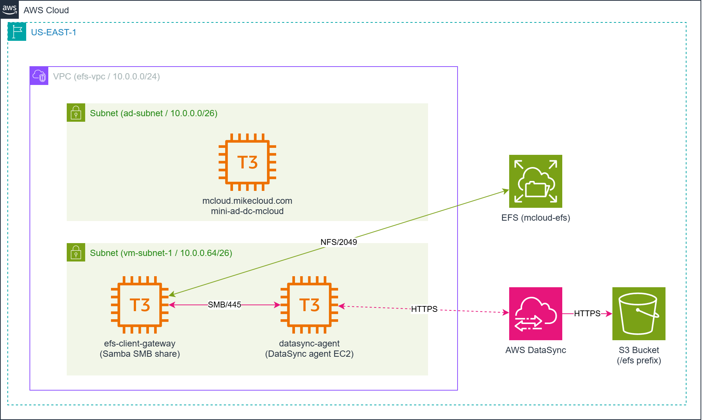
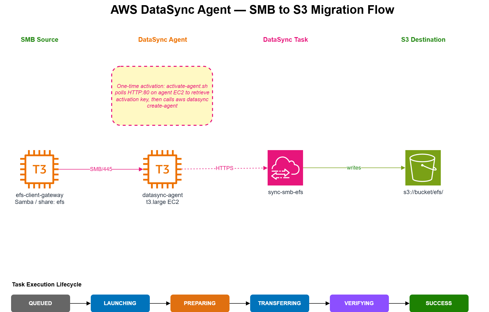

# AWS SMB to S3 Data Migration with AWS DataSync Agent

This project demonstrates **agent-based AWS DataSync** — transferring data from a Samba SMB share to S3 using a DataSync agent EC2 instance. It extends the [aws-data-sync](https://github.com/mamonaco1973/aws-data-sync) project by replacing the agentless EFS-to-S3 pattern with an agent-based SMB-to-S3 pattern.

The infrastructure is deployed in four phases:

1. **Mini Active Directory** — Samba 4 on Ubuntu acting as a Domain Controller, providing authentication and DNS for the environment.
2. **EFS + Domain-Joined Clients** — An Amazon EFS file system mounted by a Linux client that also exposes the storage as a Samba SMB share. At boot, the Linux instance clones four GitHub repositories into EFS as sample data.
3. **S3 + IAM + CloudWatch** — The S3 destination bucket, IAM role for DataSync S3 access, and CloudWatch log group for task execution logs.
4. **DataSync Agent** — A DataSync agent EC2 instance provisioned in the VPC. After Terraform apply, `activate-agent.sh` registers the agent, creates an SMB source location pointing at the Samba share, and wires it to an S3 destination task.



---

## Agentless vs Agent-Based DataSync

The key distinction this project demonstrates:

| | Agentless (aws-data-sync) | Agent-Based (this project) |
|---|---|---|
| **Source** | Amazon EFS | Samba SMB share |
| **How DataSync connects** | ENI injected directly into VPC | Agent EC2 inside VPC proxies the connection |
| **When required** | AWS-native storage (EFS, FSx) | Non-AWS or protocol-specific sources (SMB, NFS on-prem) |
| **Activation step** | None | HTTP handshake to agent port 80 |



A DataSync **agent** is an EC2 instance running AWS-provided software that acts as a bridge between the DataSync service and storage that DataSync cannot reach directly. For SMB sources, the agent mounts the share internally using `mount.cifs` and streams data to the DataSync service, which writes it to the S3 destination.

---

## How Agent Activation Works

After the agent EC2 starts, it exposes an HTTP endpoint on port 80. `activate-agent.sh` polls that endpoint and retrieves a one-time **activation key**, then calls `aws datasync create-agent` to register the agent with the DataSync service. From that point the agent is managed by DataSync and the HTTP endpoint is no longer used.

```
activate-agent.sh
  1. GET http://<agent-ip>/?gatewayType=SYNC&...&no_redirect  →  activation key
  2. aws datasync create-agent --activation-key <key>          →  agent ARN
  3. aws datasync create-location-smb                          →  SMB source ARN
  4. aws datasync create-location-s3                           →  S3 dest ARN
  5. aws datasync create-task                                   →  task ARN
  6. aws ssm put-parameter /datasync/smb-task-arn              →  stored for validate.sh
```

---

## Prerequisites

* [An AWS Account](https://aws.amazon.com/console/)
* [Install AWS CLI](https://docs.aws.amazon.com/cli/latest/userguide/getting-started-install.html)
* [Install Latest Terraform](https://developer.hashicorp.com/terraform/install)

If this is your first time following along, we recommend starting with this video: [AWS + Terraform: Easy Setup](https://youtu.be/BCMQo0CB9wk).

---

## Download this Repository

```bash
git clone https://github.com/mamonaco1973/aws-data-sync-agent.git
cd aws-data-sync-agent
```

---

## Build the Code

Run [check_env.sh](check_env.sh) to validate your environment, then run [apply.sh](apply.sh) to provision all four phases and activate the agent.

```bash
~/aws-data-sync-agent$ ./apply.sh
NOTE: Running environment validation...
NOTE: Building Active Directory instance...
NOTE: Building EC2 server instances...
NOTE: Building DataSync infrastructure...
NOTE: Building DataSync agent instance...
NOTE: Activating DataSync agent and creating SMB task...
NOTE: Running build validation...
NOTE: Infrastructure build complete.
```

---

## Build Results

### Phase 1 — Active Directory (`01-directory/`)

- VPC `10.0.0.0/24` with public and private subnets
- Internet Gateway and NAT Gateway for outbound package installation from the private subnet
- Ubuntu EC2 instance running Samba 4 as a Domain Controller and DNS server
- Domain `mcloud.mikecloud.com`, Kerberos realm `MCLOUD.MIKECLOUD.COM`
- Four AD users and four groups created at boot; all credentials stored in AWS Secrets Manager

### Phase 2 — EFS + Clients (`02-servers/`)

- Amazon EFS file system (`mcloud-efs`) with mount targets in two subnets
- Domain-joined Ubuntu EC2 instance (`efs-client-gateway`):
  - Mounts EFS at `/efs` and `/home`
  - Clones four GitHub repositories into `/efs` as sample data for DataSync
  - Exposes `/efs` as a Samba SMB share — this is the DataSync source
  - Runs `net ads join` after `realm join` to ensure winbind's machine account trust is intact for NTLMv2 authentication
- Windows Server EC2 instance joined to the domain, accessible via RDP

### Phase 3 — S3 + IAM + CloudWatch (`03-datasync/`)

- S3 bucket with server-side encryption, versioning, and public access blocked
- IAM role trusted by `datasync.amazonaws.com` with S3 read/write permissions
- CloudWatch log group `/datasync/smb-to-s3` with resource policy allowing DataSync to write logs

### Phase 4 — DataSync Agent (`04-agent/`)

- DataSync agent EC2 instance (`t3.large`) using the AWS-provided agent AMI
- Security group allowing inbound HTTP/80 for one-time activation
- After Terraform apply, `activate-agent.sh` registers the agent and creates the SMB-to-S3 task

---

## Running the DataSync Task

`validate.sh` is called automatically at the end of `apply.sh`. It reads the SMB task ARN from SSM Parameter Store, starts the task, and polls until it reaches `SUCCESS` (or exits on `ERROR`).

To re-run manually:

```bash
./validate.sh
```

To trigger the task directly:

```bash
aws datasync start-task-execution \
  --task-arn $(aws ssm get-parameter --name /datasync/smb-task-arn \
    --query Parameter.Value --output text)
```

---

## Clean Up

```bash
./destroy.sh
```

Teardown order: SMB task + locations + agent (CLI) → DataSync agent EC2 → S3 bucket and IAM → EC2 instances and EFS → Secrets Manager secrets → Active Directory infrastructure.
